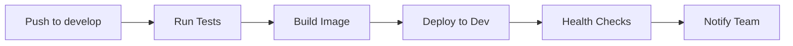
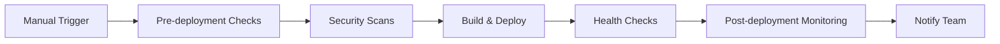

# GitHub Actions Workflows for Watch Notification Service

This repository contains comprehensive GitHub Actions workflows for CI/CD, security scanning, and infrastructure management for the Watch Notification Service deployed to Google Cloud Platform.

## 📋 Workflow Overview

### 🔄 CI/CD Workflows

1. **`ci.yml`** - Continuous Integration
   - Runs tests and builds application
   - Security scanning and code quality checks
   - Triggers on push/PR to main/develop branches

2. **`deploy-dev.yml`** - Development Deployment
   - Automatic deployment to development environment
   - Triggers on push to `develop` branch
   - Manual trigger with force deploy option

3. **`deploy-staging.yml`** - Staging Deployment
   - Deployment to staging environment
   - Triggers on push to `main` branch
   - Comprehensive testing and validation

4. **`deploy-prod.yml`** - Production Deployment
   - Manual deployment to production
   - Pre-deployment checks and post-deployment monitoring
   - Rollback capabilities

5. **`rollback.yml`** - Emergency Rollback
   - Quick rollback to previous versions
   - Supports all environments
   - Manual trigger with version selection

### 🏗️ Infrastructure Workflows

6. **`terraform-deploy.yml`** - Infrastructure Management
   - Terraform plan, apply, and destroy operations
   - Environment-specific deployments
   - State management with GCS backend

### 🔒 Security Workflows

7. **`security-scan.yml`** - Security Scanning
   - Dependency vulnerability scanning
   - Container security analysis
   - Code security analysis with CodeQL
   - Secrets detection
   - Compliance checking

## 🚀 Quick Start

### 1. Repository Setup

1. **Fork or clone** this repository
2. **Enable GitHub Actions** in your repository settings
3. **Set up environments** in GitHub repository settings:
   - `development`
   - `staging`
   - `production`

### 2. Required Secrets

Configure the following secrets in your GitHub repository:

#### GCP Authentication
```bash
GCP_SA_KEY_DEV          # Service account key for development
GCP_SA_KEY_STAGING      # Service account key for staging
GCP_SA_KEY_PROD         # Service account key for production
GCP_PROJECT_ID_DEV      # GCP project ID for development
GCP_PROJECT_ID_STAGING  # GCP project ID for staging
GCP_PROJECT_ID_PROD     # GCP project ID for production
```

#### Database Configuration
```bash
DB_PASSWORD_DEV         # Database password for development
DB_PASSWORD_STAGING     # Database password for staging
DB_PASSWORD_PROD        # Database password for production
DB_HOST_DEV             # Database host for development
DB_HOST_STAGING         # Database host for staging
DB_HOST_PROD            # Database host for production
```

#### Email Configuration
```bash
MAIL_USERNAME_DEV       # Email username for development
MAIL_USERNAME_STAGING   # Email username for staging
MAIL_USERNAME_PROD      # Email username for production
MAIL_PASSWORD_DEV       # Email password for development
MAIL_PASSWORD_STAGING   # Email password for staging
MAIL_PASSWORD_PROD      # Email password for production
```

#### Application Configuration
```bash
ADMIN_PASSWORD_DEV      # Admin password for development
ADMIN_PASSWORD_STAGING  # Admin password for staging
ADMIN_PASSWORD_PROD     # Admin password for production
```

#### Optional Integrations
```bash
SLACK_WEBHOOK_URL       # Slack webhook for notifications
SONAR_HOST_URL          # SonarQube host URL
SONAR_TOKEN             # SonarQube authentication token
SNYK_TOKEN              # Snyk API token
GITGUARDIAN_API_KEY     # GitGuardian API key
```

### 3. Environment Configuration

#### Development Environment
- **Branch**: `develop`
- **Auto-deploy**: Yes (on push)
- **Approval**: Not required
- **Resources**: Minimal (cost-optimized)

#### Staging Environment
- **Branch**: `main`
- **Auto-deploy**: Yes (on push)
- **Approval**: Required
- **Resources**: Medium

#### Production Environment
- **Branch**: Manual trigger
- **Auto-deploy**: No
- **Approval**: Required
- **Resources**: Full production specs

## 🔄 Deployment Pipeline

### Development Flow


### Production Flow


## 🛠️ Usage Examples

### Manual Deployment to Production

1. Go to **Actions** tab in GitHub
2. Select **"Deploy to Production"** workflow
3. Click **"Run workflow"**
4. Choose options:
   - **Force deploy**: Skip tests (not recommended)
   - **Rollback**: Rollback to previous version
   - **Version**: Specific version to deploy

### Emergency Rollback

1. Go to **Actions** tab
2. Select **"Emergency Rollback"** workflow
3. Choose:
   - **Environment**: dev/staging/production
   - **Version**: Leave empty for previous version

### Infrastructure Changes

1. Go to **Actions** tab
2. Select **"Terraform Infrastructure Deployment"**
3. Choose:
   - **Environment**: dev/staging/prod
   - **Action**: plan/apply/destroy

## 🔒 Security Features

### Automated Security Scans
- **Dependency scanning** with OWASP Dependency Check
- **Container scanning** with Trivy and Snyk
- **Code analysis** with GitHub CodeQL
- **Secrets detection** with TruffleHog and GitGuardian
- **Compliance checking** with Checkov

### Security Gates
- All deployments require security scans to pass
- High-severity vulnerabilities block deployments
- Secrets are automatically detected and flagged
- Compliance violations are reported

## 📊 Monitoring and Notifications

### Slack Notifications
- Deployment status updates
- Security scan results
- Infrastructure changes
- Error alerts

### GitHub Notifications
- Deployment records in GitHub
- Security scan results in Security tab
- PR comments with scan results

## 🚨 Troubleshooting

### Common Issues

#### 1. GCP Authentication Failed
```bash
# Check service account permissions
gcloud auth list
gcloud config get-value project

# Verify service account has required roles:
# - Cloud Run Admin
# - Cloud Build Editor
# - Secret Manager Secret Accessor
# - Cloud SQL Client
```

#### 2. Database Connection Issues
```bash
# Check database status
gcloud sql instances describe watch-notify-postgres

# Verify connection from Cloud Run
gcloud run services describe watch-notification-service-dev
```

#### 3. Build Failures
```bash
# Check build logs
gcloud builds list --limit=10

# Verify Docker build locally
cd backend
docker build -t test .
```

#### 4. Deployment Failures
```bash
# Check Cloud Run service status
gcloud run services describe watch-notification-service-dev

# View service logs
gcloud logging read "resource.type=cloud_run_revision"
```

### Debug Commands

#### Check Workflow Status
```bash
# View recent workflow runs
gh run list --limit 10

# View specific workflow logs
gh run view <run-id>
```

#### Manual Rollback
```bash
# List Cloud Run revisions
gcloud run revisions list --service=watch-notification-service-prod

# Rollback to specific revision
gcloud run services update-traffic watch-notification-service-prod \
  --to-revisions=REVISION_NAME=100
```

## 📈 Best Practices

### 1. Branch Strategy
- **`main`**: Production-ready code
- **`develop`**: Integration branch
- **`feature/*`**: Feature development
- **`hotfix/*`**: Emergency fixes

### 2. Deployment Strategy
- **Development**: Fast feedback, frequent deployments
- **Staging**: Full testing, production-like environment
- **Production**: Manual approval, comprehensive validation

### 3. Security Practices
- Never commit secrets to code
- Use environment-specific configurations
- Regular security scanning
- Principle of least privilege

### 4. Monitoring
- Health checks after deployment
- Performance monitoring
- Error rate tracking
- Resource utilization

## 🔧 Customization

### Environment-Specific Configurations

#### Development
```yaml
# Lower resource limits
cloud_run_cpu: "1000m"
cloud_run_memory: "512Mi"
cloud_run_max_scale: 5
cloud_run_min_scale: 0
```

#### Production
```yaml
# Higher resource limits
cloud_run_cpu: "2000m"
cloud_run_memory: "2Gi"
cloud_run_max_scale: 20
cloud_run_min_scale: 1
```

### Custom Notifications

Add custom notification channels:
```yaml
- name: Custom notification
  uses: your-custom-action@v1
  with:
    webhook_url: ${{ secrets.CUSTOM_WEBHOOK }}
    message: "Custom deployment notification"
```

## 📚 Additional Resources

- [GitHub Actions Documentation](https://docs.github.com/en/actions)
- [Google Cloud Run Documentation](https://cloud.google.com/run/docs)
- [Terraform Documentation](https://www.terraform.io/docs)
- [Security Best Practices](https://cloud.google.com/security/best-practices)

## 🤝 Contributing

1. Fork the repository
2. Create a feature branch
3. Make your changes
4. Test the workflows
5. Submit a pull request

## 📄 License

This project is licensed under the MIT License.
